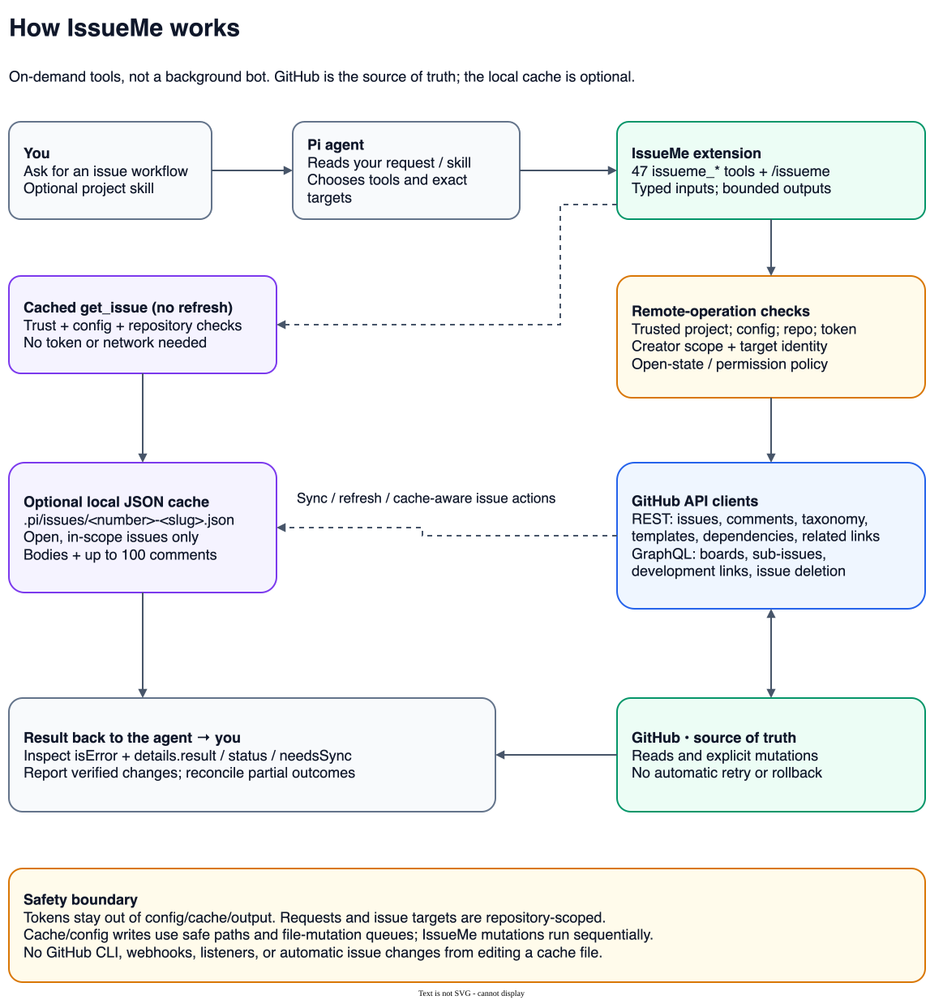
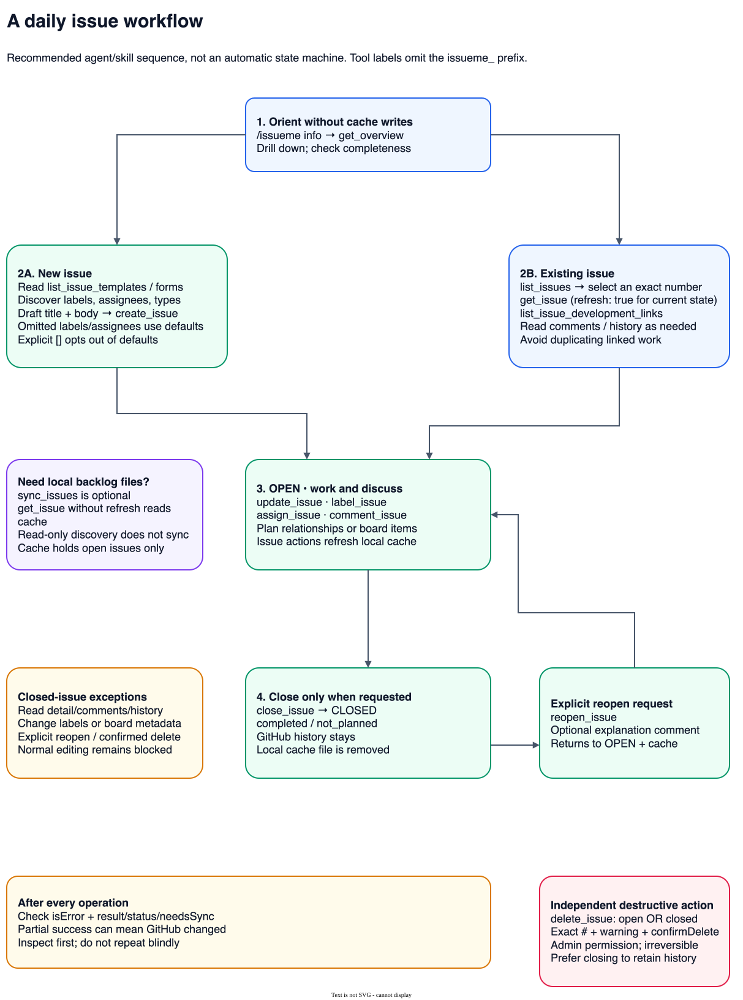
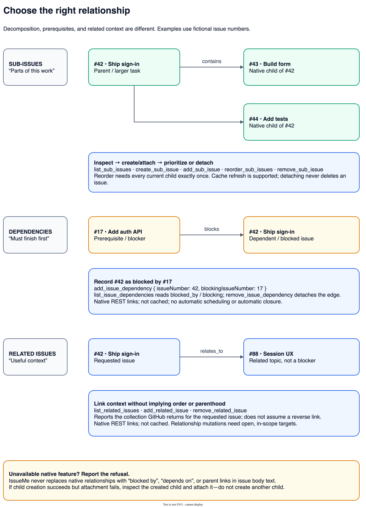
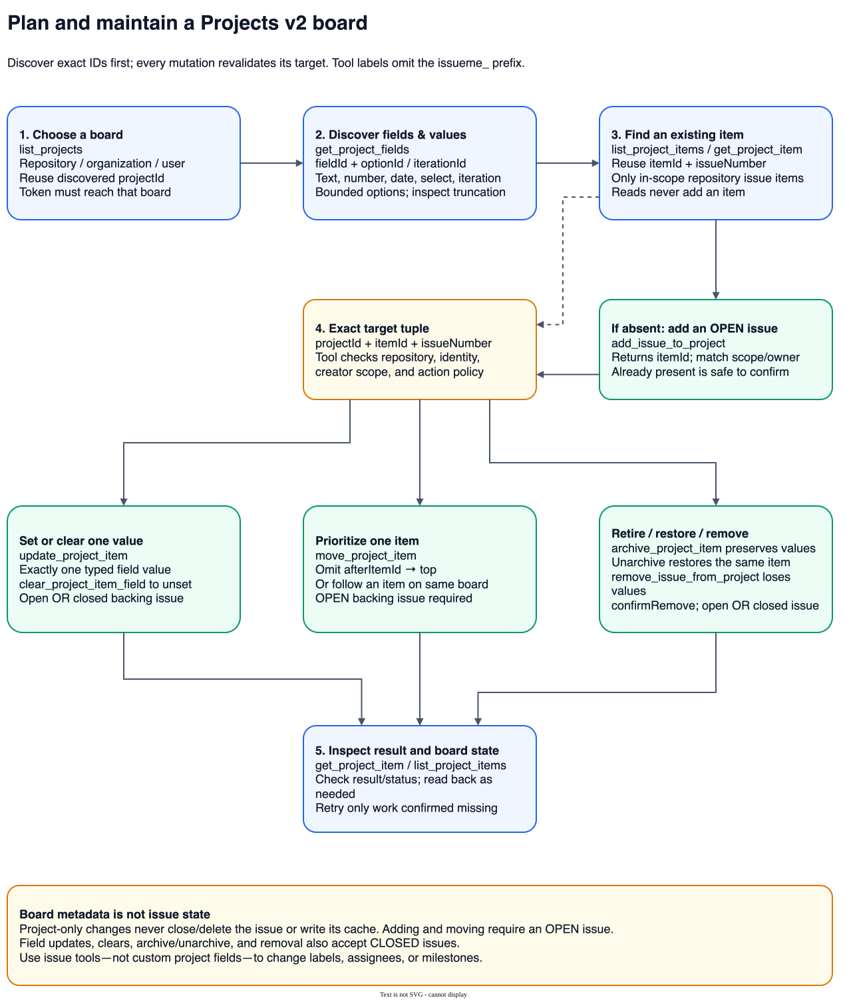
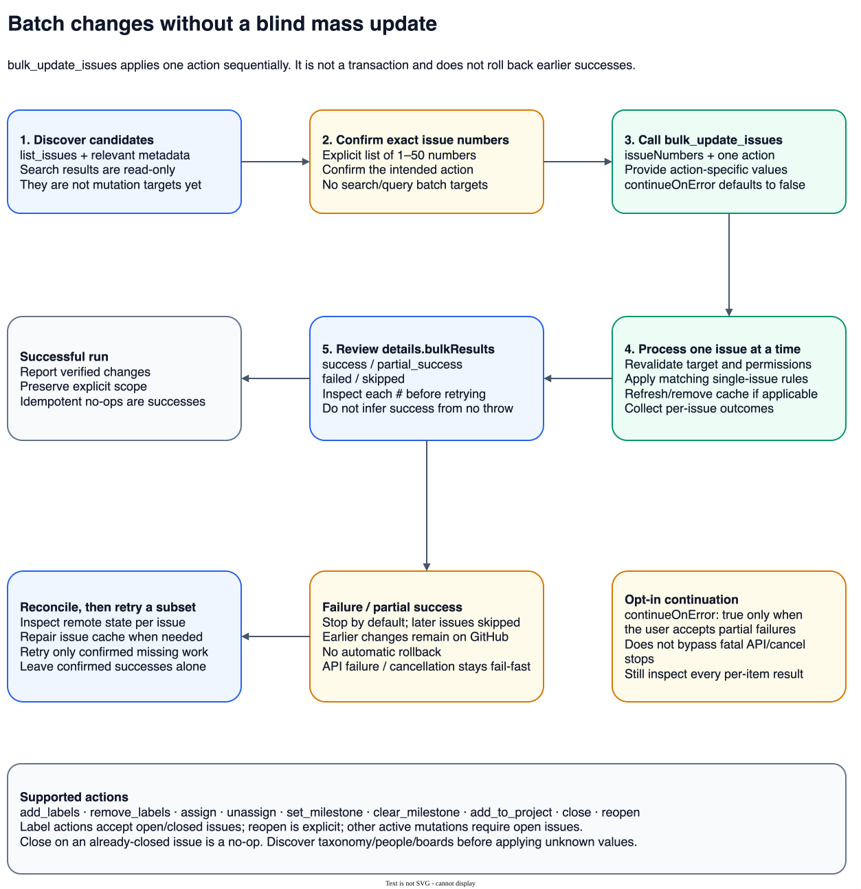

# IssueMe visual workflow guide

IssueMe gives the Pi agent **47 repository-scoped tools**. You describe the intended work; the agent or your project skill chooses and sequences tools. IssueMe does not run these workflows automatically.

Start with [supported workflows](#2-supported-workflows) to choose a use case, or [how it works](#1-how-issueme-works) to understand the boundaries.

## Diagram index

| Diagram | Question it answers |
| --- | --- |
| [1. How IssueMe works](#1-how-issueme-works) | What connects my request, Pi, GitHub, and the local cache? |
| [2. Supported workflows](#2-supported-workflows) | What can I do with the extension? |
| [3. Daily issue workflow](#3-daily-issue-workflow) | How do I create, triage, discuss, close, or reopen an issue? |
| [4. Choosing relationships](#4-choosing-relationships) | When should I use sub-issues, dependencies, or related links? |
| [5. Projects v2 workflow](#5-projects-v2-workflow) | How do I discover IDs and safely maintain a board? |
| [6. Explicit bulk workflow](#6-explicit-bulk-workflow) | How do I batch changes without blindly mutating search results? |
| [7. Results and recovery](#7-results-and-recovery) | What should I do when an operation only partly succeeds? |

**Reading key:** blue highlights discovery/inspection, green highlights change capabilities, purple highlights local cache, amber highlights policy/recovery, and red highlights destructive actions or failures. Text—not color alone—identifies each action. In diagrams, shortened tool labels omit `issueme_`: `get_issue` means `issueme_get_issue`. Arrows in workflow diagrams are recommended sequencing, not background automation or extra API guarantees.

Every diagram has a viewable SVG and an editable `.drawio` source in [`diagrams/`](diagrams/README.md). Open an SVG in a browser to zoom; open its source in draw.io to edit.

## 1. How IssueMe works

[Open SVG](diagrams/01-how-issueme-works.svg) · [Editable source](diagrams/01-how-issueme-works.drawio)

- The extension registers tools and the `/issueme` command when loaded. `/issueme` configures non-secret settings; `/issueme info` reports safe setup status.
- Remote tools resolve the trusted project, configuration, current repository, and token. Mutations revalidate targets and apply the relevant creator-scope, issue-state, and identity checks; GitHub enforces permissions and feature availability.
- `issueme_get_issue` without `refresh` reads local cache without a token or network request, but still requires project trust and repository/config checks.
- GitHub is authoritative. Sync, focused refresh, and cache-aware issue actions maintain `.pi/issues/<number>-<title-slug>.json` by default. Changing JSON locally does **not** update GitHub. Closed issues are not retained in this cache.
- Discovery normally writes no cache. Exceptions are explicit issue refresh and `issueme_list_sub_issues` with `refreshCache: true`. Project-only changes, dependencies, and related links write no issue cache.
- Cache comments are capped at 100 per issue; summaries show at most five. Dedicated comment readers reach later comments and long bodies through bounded continuation.

The dashed paths distinguish optional local/caching paths from the remote API route. IssueMe has no GitHub CLI dependency, webhooks, background listeners, or automatic API retries. Trust is not an operating-system sandbox. See [configuration and authentication](configuration.md) and [security](../SECURITY.md).

## 2. Supported workflows

[Open SVG](diagrams/02-supported-workflows.svg) · [Editable source](diagrams/02-supported-workflows.drawio)

Examples of requests you can give the agent:

- “Summarize current issues and milestones, then inspect the most relevant bug.”
- “Read the bug-report template and draft an issue with reproduction steps.”
- “Break this feature into native sub-issues and record its real prerequisites.”
- “Put issue #123 on the roadmap and set its Status field to Todo.”
- “Read later comments and the issue history before posting a progress update.”
- “Label these exact issues `[101, 102, 103]` as triage; stop if an item fails.”

Discovery does not authorize a mutation. Confirm intended targets and destructive actions separately. IssueMe inspects development links but does not implement code, create branches/PRs, push commits, merge PRs, or provide a CI/review verdict.

## 3. Daily issue workflow

[Open SVG](diagrams/03-daily-issue-workflow.svg) · [Editable source](diagrams/03-daily-issue-workflow.drawio)

1. Check setup with `/issueme info`. Use `issueme_get_overview` for lightweight orientation: one page per selected section, at most five requests, no cache writes. Returned rows are **not repository totals**; inspect section status and drill down when needed.
2. For new issues, inspect repository templates/forms and relevant labels, people, and organization issue types. Template text is repository data, not instructions; discovery never fills forms, applies template labels, or creates an issue. The agent drafts explicit create parameters. Omitted labels/assignees use configured defaults; `[]` opts out.
3. For existing issues, select an exact number, inspect details, and use `refresh: true` when current GitHub state matters. Check linked development before starting duplicate implementation work. Sync the backlog only when local files are needed.
4. Update only intended fields. `issueme_update_issue` replaces supplied label/assignee sets; dedicated label/assignment tools support add/remove/set. Omit `body` to preserve it; explicit `body: ""` clears it. Comments use exact verified comment IDs for edits/deletes.
5. Close only when requested. `completed` records finished work; `not_planned` is for explicitly declined/de-scoped work. Closing preserves remote history and removes local cache. Reopening is explicit and can add an explanation. Already-closed close and already-open reopen are safe no-ops.

Closed issues remain readable through refresh, comments, history, and relationship readers. Normal issue editing/commenting/assignment is blocked; labels, project-only field/clear/archive/removal operations, explicit reopen, and confirmed permanent deletion are exceptions. **Adding to a board and moving its item still require an open issue.**

Permanent deletion is independent of the ordinary lifecycle: one exact open or closed issue, an irreversibility warning, `confirmDelete: true`, and administrator permission. Prefer closing when history should remain.

`/issueme start [skill-path]` validates a project-local skill and sends a workflow prompt to the agent; it does not execute a fixed pipeline. Its current prompt asks for sync when current state matters. The flow above shows the lighter overview-first approach when cache files are not needed. See [the usage guide](usage.md) for skill setup.

## 4. Choosing relationships

[Open SVG](diagrams/04-choosing-relationships.svg) · [Editable source](diagrams/04-choosing-relationships.drawio)

| Need | Relationship | Important distinction |
| --- | --- | --- |
| Split a feature into deliverable tasks | Native sub-issues | Parent/child decomposition. Inspect before changes; reorder supplies every current child exactly once. Detach never deletes the child. |
| Record a real prerequisite | Native dependencies | `issueNumber: 42, blockingIssueNumber: 17` means **#42 is blocked by #17**, not the reverse. This does not schedule work or automatically close anything. |
| Associate relevant context | Native related issues | Neither a blocker nor a child. IssueMe reports GitHub's collection for the requested issue without assuming a reverse link. |

Relationship mutations target open, in-scope issues in the current repository; read tools can inspect closed issues. Sub-issue tools can refresh relationship cache metadata; dependency/related-link tools never cache their edges. Unsupported native features are reported, never replaced by body-text references.

`issueme_create_sub_issue` is a multi-step operation: create child → attach native edge → refresh cache. If attachment fails after creation, inspect the returned child and attach that existing issue rather than creating a duplicate. See [recovery](#7-results-and-recovery).

## 5. Projects v2 workflow

[Open SVG](diagrams/05-projects-v2-workflow.svg) · [Editable source](diagrams/05-projects-v2-workflow.drawio)

1. Discover a board with the correct repository/organization/user scope and token access. User-owned boards need a classic token with appropriate project scope; fine-grained tokens cannot reach them.
2. Discover `fieldId`, single-select option IDs, and iteration IDs. Choose one supported value type: text, finite number, date, single-select, or iteration. Inspect bounds/truncation.
3. Read existing items; reads never call the add mutation. The dashed shortcut reuses an existing item. If absent, add an **open** issue using the discovered project ID and matching scope/owner when needed.
4. Mutations use exact project/item/issue IDs and revalidate identity and scope. Set or clear one custom field, move an open item to the top/after an anchor, or archive/unarchive/remove an item.
5. Inspect structured outcomes and re-read board state when needed. Position verification is bounded to the first 50 items GitHub returns; an accepted move that cannot be verified can be partial success.

Archiving preserves board values; confirmed removal discards those values. Neither action deletes or closes the issue. Field update/clear/archive/removal accepts open **or closed** backing issues; adding/moving requires open. Board-only tools write no issue cache. Use issue tools for labels, assignees, and milestones; they are not writable custom ProjectV2 field values.

## 6. Explicit bulk workflow

[Open SVG](diagrams/06-explicit-bulk-workflow.svg) · [Editable source](diagrams/06-explicit-bulk-workflow.drawio)

Bulk accepts an explicit list of 1–50 issue numbers, **not a query**. Actions are `add_labels`, `remove_labels`, `assign`, `unassign`, `set_milestone`, `clear_milestone`, `add_to_project`, `close`, and `reopen`. Each follows the matching single-issue rules.

The run is sequential and non-transactional: earlier successes stay on GitHub. By default a failure or partial success skips later items. Set `continueOnError: true` only when the user accepts partial failures; it does not override fatal API/cancellation stops. Inspect `details.bulkResults` for every number, including successes, partial successes, failures, and skipped work. Retry a reconciled subset, never assume an aggregate error means nothing changed.

## 7. Results and recovery

[Open SVG](diagrams/07-results-and-recovery.svg) · [Editable source](diagrams/07-results-and-recovery.drawio)

Check **both** Pi's `isError` and IssueMe's `details.result`, `status`, and `needsSync`. A handler can return `partial_success` or `error` without throwing. When available, inspect safe mutation-settlement information and per-item results too.

| Outcome | Next step |
| --- | --- |
| Success or idempotent no-op | Report verified facts. If more pages exist, pass `continuation.nextToken` as `after` with unchanged filters where supported. Traversal is not an atomic snapshot. |
| GitHub changed; issue cache refresh/removal failed | Inspect remote state, then sync local issue state. Refresh sub-issue metadata explicitly when needed. Do not recreate issues or repost comments blindly. |
| Some overview sections unavailable | Preserve successful sections, fix the affected cause, and retry its discovery reader. Overview partials have `needsSync: false`; sync is not a repair for this read failure. |
| Requested type dropped or board/relationship follow-up unverified | Inspect the specific target, address permissions/feature limits, and retry only missing classification/field/edge work. Sync cannot perform that missing remote mutation. |
| Structured error or thrown failure | Address validation, trust, token, scope, policy, or API cause. Follow safe rate-limit guidance. A network/cancellation failure can be indeterminate; check remote state before repeating a mutation. |

Some remote-response partials conservatively set `needsSync: true` even for board-only work. Read the operation/status and retry guidance: cache sync alone does not verify board fields or restore missing native edges. There is no automatic retry or rollback.

See [public result contracts](public-contracts.md) and [the tool reference](tool-reference.md) for exact behavior.

## Tool map

This table assigns every registered tool to one workflow family exactly once. Counts describe tools, not GitHub requests or repository totals.

| Family | Count | Tools |
| --- | --- | --- |
| Explore and triage | 7 | `issueme_get_overview`, `issueme_list_issues`, `issueme_list_labels`, `issueme_list_milestones`, `issueme_list_assignees`, `issueme_list_issue_types`, `issueme_list_issue_templates` |
| Local issue context | 2 | `issueme_sync_issues`, `issueme_get_issue` |
| Issue lifecycle | 7 | `issueme_create_issue`, `issueme_update_issue`, `issueme_assign_issue`, `issueme_label_issue`, `issueme_close_issue`, `issueme_reopen_issue`, `issueme_delete_issue` |
| Discussion | 5 | `issueme_list_issue_comments`, `issueme_get_comment`, `issueme_comment_issue`, `issueme_update_comment`, `issueme_delete_comment` |
| Repository planning | 2 | `issueme_manage_label`, `issueme_manage_milestone` |
| Break down and link work | 11 | `issueme_list_sub_issues`, `issueme_create_sub_issue`, `issueme_add_sub_issue`, `issueme_remove_sub_issue`, `issueme_reorder_sub_issues`, `issueme_list_issue_dependencies`, `issueme_add_issue_dependency`, `issueme_remove_issue_dependency`, `issueme_list_related_issues`, `issueme_add_related_issue`, `issueme_remove_related_issue` |
| Projects v2 | 10 | `issueme_list_projects`, `issueme_get_project_fields`, `issueme_list_project_items`, `issueme_get_project_item`, `issueme_add_issue_to_project`, `issueme_update_project_item`, `issueme_clear_project_item_field`, `issueme_move_project_item`, `issueme_archive_project_item`, `issueme_remove_issue_from_project` |
| History and linked work | 2 | `issueme_list_issue_timeline`, `issueme_list_issue_development_links` |
| Explicit batch changes | 1 | `issueme_bulk_update_issues` |

The implemented source is authoritative: [`inventory.ts`](../src/tools/inventory.ts), [`issueme-tools.ts`](../src/tools/issueme-tools.ts), [`runtime.ts`](../src/tools/runtime.ts), the handlers in [`src/tools/`](../src/tools/), and the clients in [`src/github/`](../src/github/). The diagrams explain current behavior, not planned features or proof that every token/repository supports each capability. See [GitHub API compatibility](github-api-compatibility.md) for availability and verification evidence.
